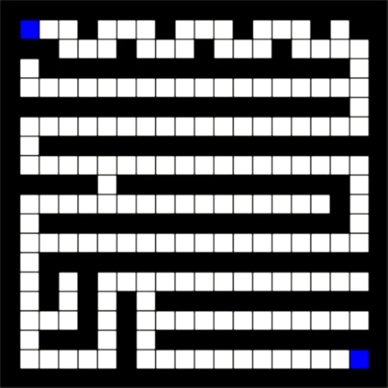

# Pathfinder
Pathfinder and Visualiser application

 I built an application to find the shortest path between two nodes in a grid and then visualize the algorithm
 taking place using pygame in Python 3. You can set the two nodes to any location on the grid, draw walls to
 create a maze and the algorithm (Dijkstra's) will always find the shortest path. I built this app because coming
 from a mathematics background I was fascinated by algorithms, I took it onto myself to learn how Dijkstra’s
 algorithm worked and then implement a tool to demonstrate it in action. This application has many fields that it can
 be applied to such as pathfinding AI in a game or route planning on a map.

# Gif Demo

